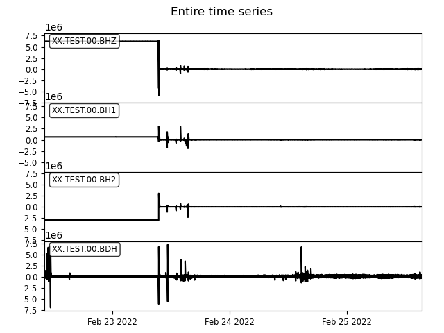
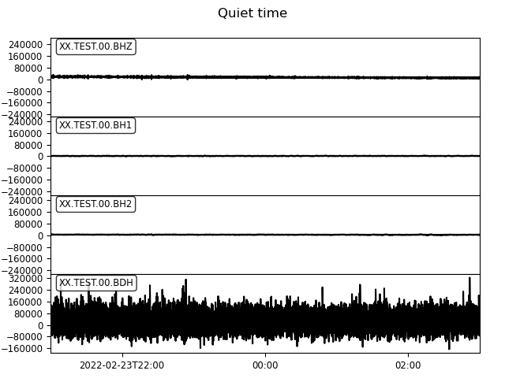
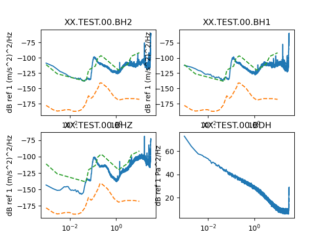
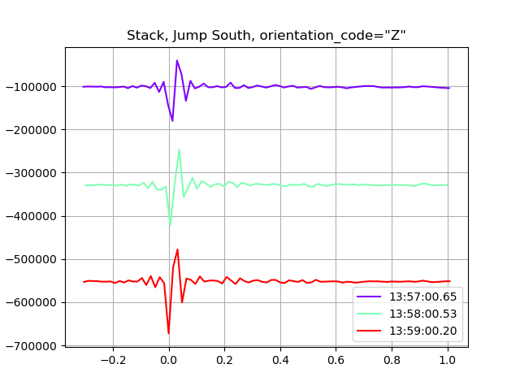
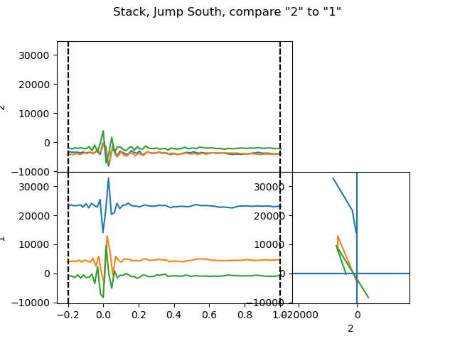

*******************************
obstest
*******************************

obstest plots four types of control plot associated with validation tests:
- time series: to see the actual waveforms
- spectra: to see/compare noise levels
- stack: to plot repeated tests (such as jumping and taps) on top of each other
- particle_motion: to verify the orientation and directionality of channels


#################
Control files
#################

obstest uses YAML-format control files to indicate what kind of plots to
output.  The datetime ranges in the `plots` sections must be within those given
in the `input` section, as data is only read using the `input` time bounds.

Format
===============================

There are 4 sections in each lctest.yaml file:

- ``input``: input data parameters
    - ``SDS_dir``: The SeisComp Data Structure directory to read all data from
    - ``xml_file``: The StationXML file containing metadata for all stations
    - ``description``: Overall description of the tests/data
- ``output``: output plot file parameters
    - ``show``: show the plots?  If False, just save them to files
    - ``filebase``: start of each output filename (may include directory)

- ``plots``: the plots to make
    - ``time_series``: a list of waveform plots to make, each item contains:
        - ``description``: plot title
        - ``select``: parameters to select a subset of the
                      waveforms (see obspy.core.stream.Stream.select())
        - ``start_time``: plot start time
        - ``end_time``: plot end time

    - ``spectra``: list of spectra plots to make, each item contains:
        - ``description``: plot title
        - ``select``: as in ``time_series``
        - ``start_time``: data start time
        - ``end_time``: data end time
        - ``overlay``: overlay spectra on one plot? (True)

    - ``stack``: a list of stacked waveform plots to make.
               Useful when you performed a test action (tap, lift, jump, etc)
               several times.
               Each item contains:
        - ``description``: plot title
        - ``components``: a list of orientation codes to plot (one plot
                                 for each orientation code)
        - ``times``: list of times to plot at (each one "yyyy-mm-ddTHH:MM:SS")
        - ``offset_before.s``: start plot this many seconds before each `time`
        - ``offset_after.s``: end plot this many seconds after each ``time``

    - ``particle_motion``: a list of particle motion plots to make.
                           Use to evaluate the orientation and polarity of
                           the channels.
                           Each item contains:
        - ``description``**: as in ``time_series``
        - ``component_x``: component to plot on the x axis
        - ``component_y``: component code to plot on the y axis
        - ``times``: as in ``stack```
        - ``particle_offset_before.s``: start particle motion plot this many
                                        seconds before each ``time``
        - ``particle_offset_after.s``: end particle motion plot this many
                                       seconds after each ``time``
        - ``offset_before.s``: start time series plot this many seconds before
                               each ``time``
        - ``offset_after.s``: end time series plot this many seconds after
                              each ``time``

``plot_globals`` [optional]: Default values for each type of plot.
                             Same parameters as for ``plots``


```
python
> import obs
> help(lcheapo.lctest)
```

Example control files
===============================

to write example control files in the current directory, type:

```
obstest --examples
```

#################
Examples
#################


1: Analysing one station
===============================

Control file
-------------------------------

.. code-block:: yaml
    ---
    input: 
        start_time: "2022-02-22T10:00:01"
        end_time: "2022-02-25T15:25:25"
        datafiles:
            -   name: "TestAcq-BB02-ProgV1-3.raw.lch"
                obs_type: 'BBOBS1'
                station: 'TEST'
        description: "Tests on BBOBS"
    output:
        show: True
        filebase: 'BB02-V1_3-tests'
    plot_globals:
        spectra:
            window_length.s: 1024
    plots:
        time_series:
            -   description: "Entire time series"
                select: {station: "*"}
                start_time: "2022-02-22T10:00:01"
                end_time: "2022-02-25T15:25:25"
            -   description: "Quiet time"
                select: {station: "*"}
                start_time: "2022-02-23T21:00:00"
                end_time: "2022-02-24T03:00:00"
            -   description: "Stack time"
                select: {station: "*"}
                start_time: "2022-02-25T13:54:00"
                end_time: "2022-02-25T14:03:00"
        spectra:
            -   description: "Quiet time"
                select: {station: "*"}
                start_time: "2022-02-23T21:00:00"
                end_time: "2022-02-24T03:00:00"
        stack:
            -   description: "Stack, Jump South"
                orientation_codes: ["Z"]
                offset_before.s: 0.3
                offset_after.s: 1
                times:
                -    "2022-02-25T13:57:00.66"
                -    "2022-02-25T13:58:00.53"
                -    "2022-02-25T13:59:00.2"
            -   description: "Stack, Jump Est"
                orientation_codes: ["Z"]
                offset_before.s: 0.3
                offset_after.s: 1
                times:
                -    "2022-02-25T14:00:00.4"
                -    "2022-02-25T14:01:00.15"
                -    "2022-02-25T14:02:00.18"
        particle_motion:
            -   description: "Stack, Jump South"
                orientation_code_x: "2"
                orientation_code_y: "1"
                offset_before.s: 0.00
                offset_after.s: 0.03
                offset_before_ts.s: 0.2
                offset_after_ts.s: 1
                times:
                -    "2022-02-25T13:57:00.66"
                -    "2022-02-25T13:58:00.53"
                -    "2022-02-25T13:59:00.2"
            -   description: "Stack, Jump Est"
                orientation_code_x: "2"
                orientation_code_y: "1"
                offset_before.s: 0.1
                offset_after.s: 0.2
                offset_before_ts.s: 0.3
                offset_after_ts.s: 1
                times:
                -    "2022-02-25T14:00:00.4"
                -    "2022-02-25T14:01:00.15"
                -    "2022-02-25T14:02:00.18"
Output plots
-------------------------------

time_series
*******************



    Entire time series
    
    


    Quiet period in the middle of the night

spectra
*******************


    Quiet period in the middle of the night

stack
*******************


    Stack plot of jumps along the south axis of the instrument

particle_motion
*******************


    Particle motion plot of jumps along the south axis of the instrument


2: Comparing several stations
===============================

Control file
-------------------------------

.. code-block:: yaml
    ---
    input:
        start_time: null
        end_time: null
        datafiles:
            - 
                name: "20191107T14_SPOBS09_F02.raw.lch"
                obs_type: "SPOBS2"
                station: "09F2"
            - 
                name: "20191107T14_SPOBS09_F02.raw.lch"
                obs_type: "SPOBS2"
                station: "09c1"
            - 
                name: "20191107T14_SPOBS09_F02.raw.lch"
                obs_type: "SPOBS2"
                station: "09c2"
        description: "Simulation of multi-instrument test"
    output:
        show: True
        filebase: "MAYOBS6"
    plot_globals:
        stack:
            offset_before.s: 0.5
            offset_after.s:  1.5
            plot_span: False
        particle_motion:
            offset_before.s: 0.00
            offset_after.s: 0.03
            offset_before_ts.s: 0.1
            offset_after_ts.s: 0.2
        spectra:
            window_length.s: 100
    plots:
        time_series:
            -
                description: "Entire time series"
                select: {station: "*"}
                start_time: null
                end_time: null
            -
                description: "Quiet period"
                select: {channel: "*3"}
                start_time: null
                end_time: "2019-11-07T13:57"
            -
                description: "Rubber hammer taps"
                select: {station: "*"}
                start_time: "2019-11-07T14:08"
                end_time: "2019-11-07T14:11:10"
        spectra:
            -
                description: "Entire time series"
                select: {component: "3"}
                start_time: null
                end_time: null
            -
                description: "Quiet period"
                select: {channel: "*3"}
                start_time: null
                end_time: "2019-11-07T13:57"
